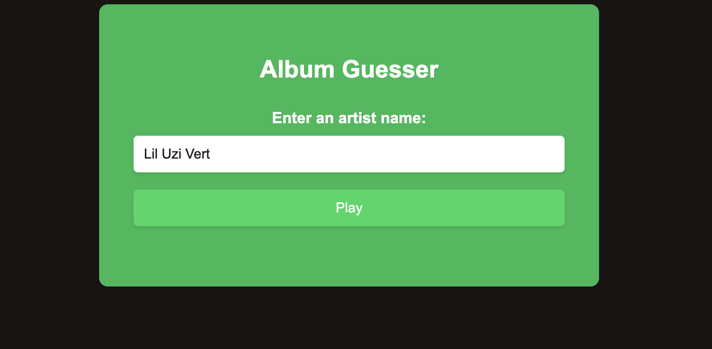
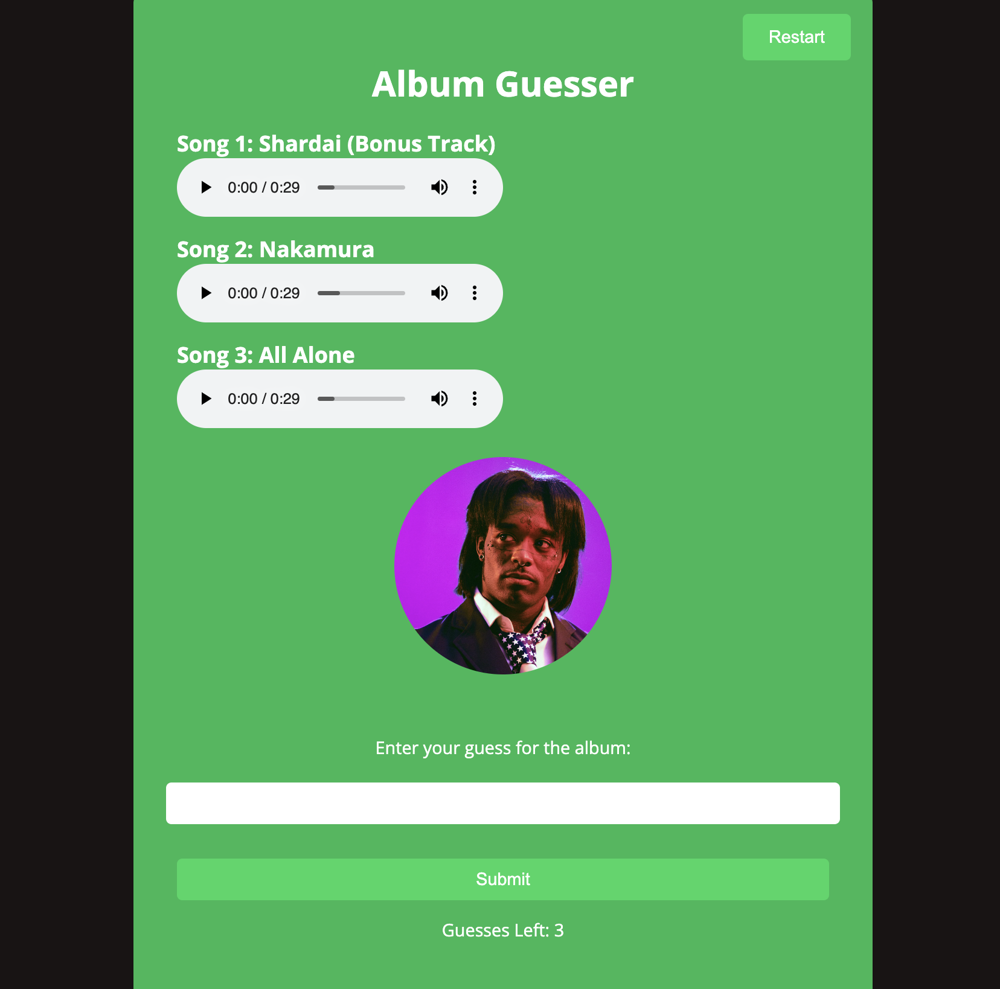
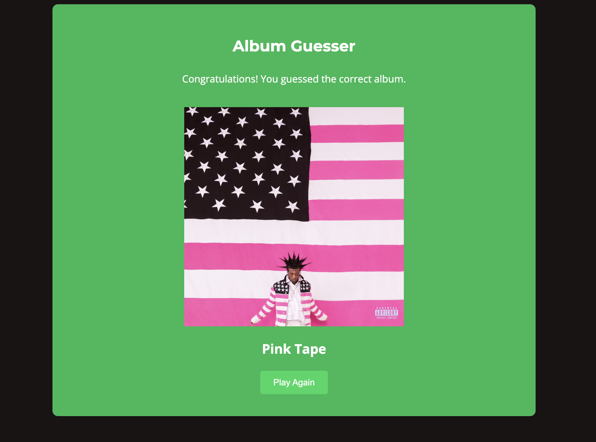

# Album Guesser

Album Guesser is a web-based guessing game where players have to guess the correct album name based on a selection of three random songs by a specific artist.

## Features

- Uses Spotify's Web Developer API to use artist, album, and song databases
- Provides a random selection of songs by an artist.
- Allows users to guess the correct album name based on 3 songs in the album.
- Provides feedback on whether the guess is correct or incorrect.
- Shows the artist image for visual reference.
- Shows the album cover at the end of the game
- If the desired artist has song previews, it lets the user play them
- Limits the number of guesses per game to 3.
- Includes a restart and play again button

## Requirements

- A valid Spotify account
- Python 3.7 or higher
- Flask
- FuzzyWuzzy
- A CLIENT_ID and CLIENT_SECRET which is given by using Spotify's Web API at this link:
  https://developer.spotify.com/documentation/web-api/concepts/apps

## Setup and Usage

1. Clone the repository:
   ```shell
   git clone https://github.com/your-username/Album_Guesser.git


## Walkthrough

### 1. Clone the repository and get the Album-Guesser Game running
### 2. If you are trying to guess an album for the artist: _Lil Uzi Vert_, this is the screen you will see

### 4. As you click Play, this is what you will see(remember that for some artists, the preview isn't available, so it isn't on the page)

### 5. If you guess the album correctly, you will get to this screen

